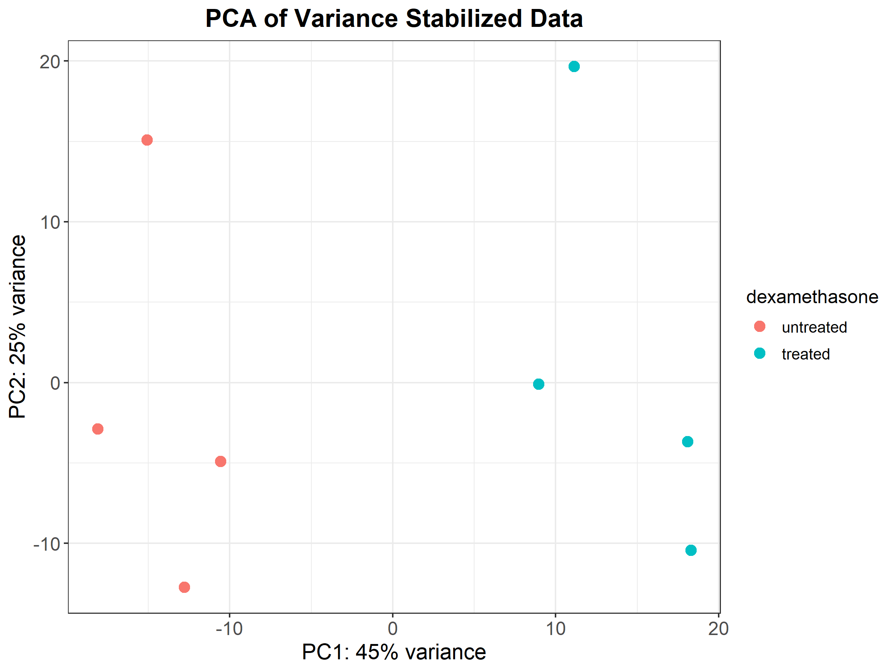
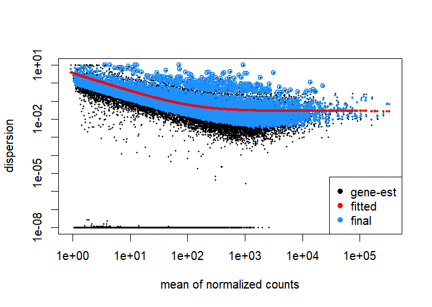
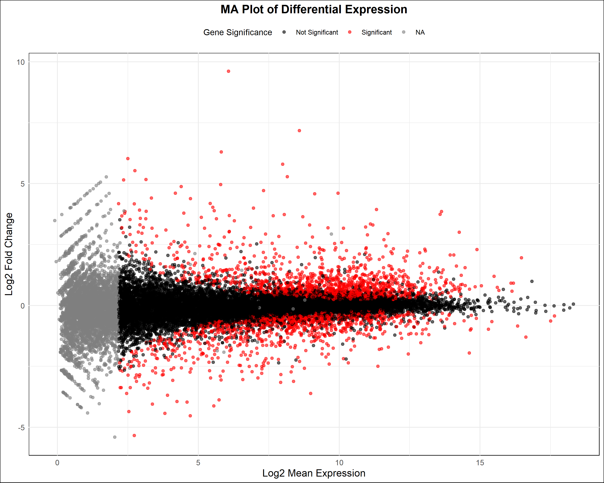
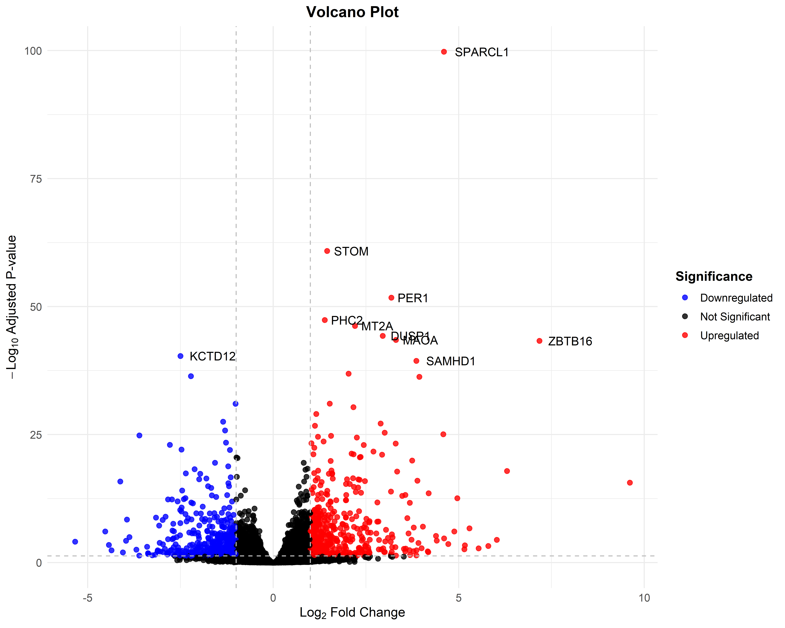
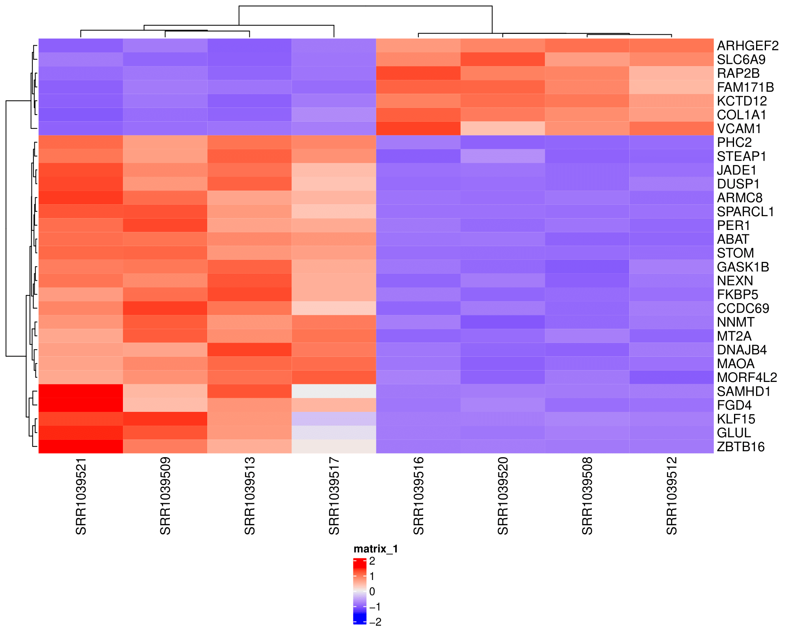

# RNA Seq Analysis Workflow

## A Comprehensive Guide to Analyzing Gene Expression Data

### By Ali Hamza

---

## Table of Contents

1. Introduction
2. What is RNA sequencing?
3. Why Do We Need RNA Sequencing?
4. Basic Workflow of RNA Sequencing
5. Files Obtained After RNA Sequencing 
6. Basic Workflow of RNA-Seq Analysis
7. Installing Linux on Windows (WSL)
8. Basic Commands in Ubuntu (WSL)
9. Important Programs for RNA-seq Analysis in Linux
10. RNA-seq Analysis: Checking Quality of FASTQ Files Using FastQC
11. RNA-seq Analysis: Trimming Reads Using Trimmomatic
12. RNA-seq Analysis: Alignment Reads with HISAT2
13. RNA-seq: Creating Feature Count Matrix
14. Analyzing Differential Expression Genes in R
15. Installing important packages and loading data
16. Performing basic quality checks
17. Building DESeq2 data set
18. Concept of leaky expression
19. Setting reference for DEGs analysis and performing analysis
20. Converting gene IDs to gene names
21. Size Factor Estimation in DESeq2
22. Concept of dispersion, P-value and adjusted P-value (Padj)
23. Quality check of RNA-seq data
24. Mean-avearge plot
25. Getting idea about best genes
26. Building Volcano plot
27. Building Heatmap
28. Performing GO enrichment analysis
29. Performing KEGG pathway analysis 
30. References
---

## Introduction

Differential expression analysis is a crucial aspect of understanding the functional implications of gene expression data. This book provides a comprehensive guide to performing differential expression analysis using Linux and R. The following chapters will walk you through the necessary steps, from setting up your environment to visualizing and interpreting your results.

---

## What is RNA Sequencing?

RNA sequencing (RNA-seq) is a technique used to analyze the quantity and sequences of RNA in a sample. It provides insights into gene expression and helps identify which genes are active in different conditions. By sequencing the RNA, researchers can understand the functional elements of the genome and how they change across different conditions or treatments.

---

## Why Do We Need RNA Sequencing?

We need RNA sequencing to understand gene expression patterns and how they change under different conditions. For example, in plants, RNA-seq can reveal how genes respond to drought stress, helping develop more resilient crop varieties.

---

### Basic Workflow of RNA Sequencing
RNA sequencing (RNA-seq) is a powerful technique used to analyze the transcriptome of cells, tissues, or organisms. Here's a basic workflow for RNA sequencing:

1. **RNA Extraction**: First, RNA is isolated from the sample of interest. This step involves breaking open cells to release RNA and then purifying it from other cellular components.

2. **RNA Quality Control**: The quality and quantity of the extracted RNA are assessed using methods such as spectrophotometry (UV absorbance) and gel electrophoresis. This ensures that the RNA is intact and suitable for sequencing.

3. **Library Preparation**: RNA molecules are converted into cDNA (complementary DNA) libraries that are suitable for sequencing. This process involves:

4. **RNA Fragmentation**: Breaking RNA into smaller pieces.
Reverse Transcription: Using these RNA fragments as templates to synthesize cDNA.
Adaptor Ligation: Adding adaptors to cDNA fragments for sequencing.
5. **Sequencing**: The prepared cDNA libraries are sequenced using high-throughput sequencing platforms (e.g., Illumina sequencing). This step generates millions of short reads (sequences) corresponding to the cDNA fragments.

When a gene is highly expressed, it means that a larger number of RNA transcripts are being produced from that gene within the cell or tissue being studied. During RNA sequencing, this abundance of RNA translates directly into more cDNA molecules synthesized during library preparation. As a result, genes with higher expression levels will yield a greater amount of sequencing data, represented by more sequencing reads that align to their transcripts.

---

## File Obtained After RNA Sequencing 
After RNA sequencing, the primary data obtained is typically stored in a FASTQ file format. Here's what each of these files contains:

1. **FASTQ Files**:

    - **Reads**: Each read represents a short sequence of nucleotides (A, T, C, G) that was sequenced from the cDNA libraries prepared during RNA sequencing.
    
    - **Quality Scores**: For each nucleotide in a read, a corresponding quality score is provided. These scores indicate the confidence in the accuracy of each base call. Higher scores indicate higher confidence.

2. **SAM/BAM Files**:

    - **SAM (Sequence Alignment/Map) Files**: These are text files that store sequence alignment information. Each read from the FASTQ file is mapped or aligned to a reference genome or transcriptome. SAM files include:
    
        - Header: Contains information about the reference sequences and alignment software.
    
        - Alignment Records: Each record describes how a read aligns to the reference sequence, including its position, alignment quality, and any mismatches or gaps.

    - **BAM (Binary Alignment/Map) Files**: BAM files are the binary version of SAM files. They contain the same alignment information but in a compressed binary format, which makes them more efficient for storage and manipulation.
 ---

## Basic Workflow of RNA-Seq Analysis
Once RNA-seq data in FASTQ format is obtained, the analysis typically begins with quality checking and trimming to ensure sequencing data integrity. Following this, reads are aligned to a reference genome or transcriptome to determine their origin and generate alignment files (SAM/BAM). Subsequently, counts of aligned reads are extracted to create a Feature Counts Matrix (FCM), where rows represent features (e.g., genes) and columns represent samples. This entire process is conducted in a Linux environment. Once the FCM is prepared, it is transferred to RStudio for further analysis. In RStudio, differential gene expression analysis is performed to identify genes that are significantly differentially expressed between conditions or samples. Visualization tools in RStudio, such as ggplot2, are then used to interpret and present the results effectively. Initially, the analysis focuses on handling a single file, with plans to scale up to multiple files efficiently using Bash scripts for automation.
    
---

## Installing Linux on Windows (WSL)
To install Linux on Windows using Windows Subsystem for Linux (WSL) and to understand basic commands, here are the steps along with some fundamental commands:

1. **Enable WSL Feature**:
   - Open the Windows Start menu and type "Windows Features".
   - Select "Turn Windows features on or off".
   - Scroll down and check "Windows Subsystem for Linux".
   - Click OK and restart your computer when prompted.

2. **Install Ubuntu from Microsoft Store**:
   - Open the Microsoft Store from the Start menu.
   - Search for "Ubuntu" and select the Ubuntu distribution you prefer (e.g., Ubuntu 20.04 LTS).
   - Click "Install" and wait for the installation to complete.

3. **Launch Ubuntu**:
   - Once installed, launch Ubuntu from the Start menu.
   - The first time you launch, it will initialize and install necessary files. This may take a few minutes.

4. **Set Up Ubuntu**:
   - Create a username and password when prompted. This username does not need to match your Windows username but should be chosen carefully.

## Basic Commands in Ubuntu (WSL)

- **`cd` (Change Directory)**:
  - Use `cd` followed by a directory path to navigate through the file system. For example, `cd /mnt/c/Users/YourUsername/` moves to your Windows user directory.

- **`ls` (List)**:
  - Use `ls` to list files and directories in the current directory. Adding options like `-l` (long listing) or `-a` (include hidden files) provides more details.

- **`pwd` (Print Working Directory)**:
  - Displays the current directory path.

- **`mkdir` (Make Directory)**:
  - Create a new directory. Example: `mkdir my_folder`.

- **`touch`**:
  - Create an empty file. Example: `touch myfile.txt`.

- **`nano` or `vim` (Text Editors)**:
  - Edit text files using these command-line text editors. Example: `nano myfile.txt`.

- **`apt` (Advanced Package Tool)**:
  - Install, update, and manage software packages. Example: `sudo apt update` (update package lists).

- **`sudo` (Super User Do)**:
  - Execute commands with superuser (administrator) privileges. Example: `sudo apt install package_name`.

- **`man` (Manual Pages)**:
  - Access the manual pages for commands to learn more about their usage. Example: `man ls`.

These commands provide a basic foundation for navigating and interacting with files and directories in Ubuntu (WSL). They are similar across Linux distributions, including those running on macOS.

---

## Important Programs for RNA-seq Analysis in Linux

1. **FastQC**
   - **Purpose**: FastQC is used for quality control of sequencing data.
   - **Function**: It generates detailed reports on various quality metrics such as per base sequence quality, GC content, sequence duplication levels, and overrepresented sequences.

2. **Trimmomatic**
   - **Purpose**: Trimmomatic is a tool for trimming adapters and filtering low-quality bases from sequencing reads.
   - **Function**: It improves the quality of data by removing adapter sequences, leading to more accurate downstream analysis results.

3. **Hisat2**
   - **Purpose**: Hisat2 is an alignment tool for mapping RNA-seq reads to a reference genome or transcriptome.
   - **Function**: It efficiently aligns reads, taking into account spliced alignments for mapping to eukaryotic genomes, and outputs SAM/BAM files for downstream analysis.

4. **Subread**
   - **Purpose**: Subread provides tools for read mapping, counting, and SNP calling.
   - **Function**: It performs read alignment and generates count data for RNA-seq reads mapping to genomic features like genes or exons. Subread's featureCounts is commonly used for generating the Feature Counts Matrix (FCM).

These programs are essential tools in the RNA-seq analysis pipeline, facilitating quality control, read trimming, read alignment, and quantification of gene expression levels from high-throughput sequencing data in a Linux environment.

---
## RNA-seq Analysis: Checking Quality of FASTQ Files Using FastQC
After installing Linux and setting up your environment, our first step in RNA-seq analysis is to assess the quality of FASTQ files using FastQC.

### Steps to Check the Quality of FASTQ Files Using FastQC
### Install FastQC

To install FastQC on your Linux environment, follow these steps:

1. **Update package lists**:
      ```bash
      sudo apt-get update
      sudo apt-get install fastqc

2. **Prepare Your Environment**:
   - Open Ubuntu and navigate to a dedicated folder for RNA-seq analysis. You can create and navigate to this folder using commands like:
     ```bash
     cd /mnt
     mkdir rna-seq-workflow
     cd rna-seq-workflow
     ```
   - Place your FASTQ file (e.g., `your_fastq_file.fastq`) into this folder.

3. **Run FastQC**:
   - Open the terminal in Ubuntu.
   - Navigate to your RNA-seq folder (if not already there):
     ```bash
     cd /mnt/rna-seq-workflow
     ```
   - Run FastQC on your FASTQ file:
     ```bash
     fastqc your_fastq_file.fastq
     ```
   - This command generates a report in HTML format (`your_fastq_file_fastqc.html`) and a ZIP file containing additional details (`your_fastq_file_fastqc.zip`).

3. **Analyze FastQC Reports**:
   - Access the HTML report generated by FastQC (`your_fastq_file_fastqc.html`).
   - Open this file in a web browser to view detailed quality metrics and assessments.

#### FastQC Report Details:

The FastQC report provides several key metrics and assessments:

- **Basic Statistics**: Overview of the number of reads, read length distribution, and GC content.
- **Per Base Sequence Quality**: Quality scores across each base position in the read, highlighting potential areas of low-quality sequencing.
- **Per Sequence Quality Scores**: Distribution of average quality scores per read.
- **Sequence Length Distribution**: Histogram showing the distribution of read lengths.
- **Overrepresented Sequences**: Identification of sequences that appear frequently and could indicate contaminants or adapters.
- **Adapter Content**: Detection of adapter sequences that may need to be trimmed.
- **Sequence Duplication Levels**: Evaluation of duplicate reads, which may indicate PCR artifacts.
- **Kmer Content**: Analysis of overrepresented k-mers in the data.

#### Practice FASTQ File:
To practice, you can download a sample FASTQ file named [test.fastq](link_to_your_file) from our repository folder.

---

## RNA-seq Analysis: Trimming Reads Using Trimmomatic

After performing the first step, which is checking the quality of reads using FastQC, let's move onto the next step, which involves trimming reads using Trimmomatic.

## Using Trimmomatic

1. **Download and Setup Trimmomatic**:
   - Download Trimmomatic version 0.39 binary from [here](http://www.usadellab.org/cms/?page=trimmomatic).
   - Extract the downloaded zip file and copy the `Trimmomatic-0.39.jar` software to your RNA-seq analysis folder.

2. **Perform Trimming**:
   - Open a terminal in Ubuntu and navigate to your RNA-seq folder:
     ```bash
     cd /mnt/rna-seq-workflow
     ```
   - Use the following command to trim your sequencing data:
     ```bash
     java -jar Trimmomatic-0.39.jar SE -threads 4 your_input.fastq your_output_trimmed.fastq TRAILING:10 PHRED33
     ```
     - **Explanation of Parameters**:
       - `SE`: Specifies that the data is single-end. If your data is paired-end, use `PE` instead.
       - `-threads 4`: Specifies the number of threads to use (adjust according to your system capabilities).
       - `your_input.fastq`: Input FASTQ file containing sequences to be trimmed.
       - `your_output_trimmed.fastq`: Output file name for trimmed sequences.
       - `TRAILING:10`: Removes bases from the end of a read if below a quality score of 10.
       - `PHRED33`: Specifies the quality encoding used in the input FASTQ file.

3. **Understanding Trimmomatic Output**:
   - After running the command, Trimmomatic will output a summary line indicating how many reads were dropped due to trimming. For example:
     ```
     TrimmomaticSE: Started with 1000000 reads
     TrimmomaticSE: Dropped 50000 reads (5.0%) due to low quality
     ```
     - **Note**: This is an example and actual numbers will vary based on your data.

4. **Concept of Trimming**:
   - Trimming removes low-quality bases from reads to improve data quality and reliability for downstream analysis. Parameters like `TRAILING:10` specify the quality threshold below which bases are removed.

5. **Post-Trimming Quality Check**:
   - Once trimming is complete, use FastQC again on your trimmed FASTQ file (`your_output_trimmed.fastq`) to assess the impact of trimming on read quality.

---

## RNA-seq Analysis: Alignment Reads with HISAT2
#### Step 1: Preparing for Alignment
After trimming your RNA-seq reads, the next step is to align them with a reference genome using HISAT2.
#### Step 2: Installing HISAT2 on Linux
To install HISAT2 on Linux, you can use the following command:
```
sudo apt-get update
sudo apt-get install hisat2
```
#### Step 3: Obtaining Reference Genome Files
Before performing alignment, you need to obtain the reference genome files:

- For commonly used genomes like human (GRCh38), these files are available on the HISAT2 website.
- For other species like rice, you would need to download the corresponding FASTA (`.fa`) and GTF (`.gtf`) files.
#### Step 4: Performing Alignment
As we wroked on humangenome (GRCh38), the command to align reads using HISAT2 is structured as follows:
```
hisat2 -q --rna-strandness R -x grch38/genome_index -U trimmed_reads.fastq | samtools view -bS - > aligned_reads.bam
```
Explanation of parameters:
* `-q`: Input files are in FASTQ format.
* `--rna-strandness R`: Specifies RNA strand-specificity. Here, 'R' indicates reverse strand-specific (typically for Illumina TruSeq).
   Other options include 'F' for forward strand-specific and 'U' for unstranded.
* `-x grch38/genome_index`: Path to the HISAT2 index files for the GRCh38 genome.
* `-U trimmed_reads.fastq`: Specifies the input file containing trimmed RNA-seq reads.
* `| samtools view -bS - > aligned_reads.bam`: Pipes the output directly to `samtools` to convert SAM format to BAM format and save as `aligned_reads.bam`.
#### Step 5: Converting to BAM Format

The output of HISAT2 is typically in SAM format (`aligned_reads.sam`). To convert it to BAM format (`aligned_reads.bam`), use `samtools` as shown in the command above.

---

## RNA-seq: Creating Feature Count Matrix

The purpose of this step is to quantify the number of reads mapped to each gene, creating a feature count matrix. This matrix serves as the basis for downstream differential expression analysis.

### Using FeatureCounts

1. **Using Annotation File**
   * We use the GTF annotation file obtained from HISAT2, which describes the genomic features including genes.

2. **Understanding Paired-End Sequencing (S1 and S2)**
   * For paired-end sequencing data:
      * `-s1`: Count both reads of a read pair if both reads map to the same gene.
      * `-s2`: Count only the first read of a read pair if both reads map to the same gene (default).
3. **Running FeatureCount**

   Open a terminal in Ubuntu and navigate to your RNA-seq folder and use the following commands:
   
   ```bash
   cd /mnt/rna-seq-workflow

   featureCounts -s1 -a "annotation_file.gtf" -o counts.txt "aligned_reads.bam"
**Explanation of Parameters**:
* `-s1`: Count both reads of a read pair.
* `-a "annotation_file.gtf"`: Specifies the GTF annotation file obtained from HISAT2.
* `-o counts.txt`: Output file containing the feature count matrix in text format.
* `"aligned_reads.bam"`: Input BAM file containing aligned and sorted reads from HISAT2.
4. **Processing Output**
   * After running featureCounts, it generates a text file (`counts.txt`) containing the counts of reads mapped to each gene.

2. **Formatting the Output**
   * Open the `counts.txt` file in Excel or any text editor, and:
     * Delimit columns by spaces.
     * Save the file where the first column represents gene IDs and subsequent columns represent sample counts.

3. **Focus on Gene IDs and Read Counts**
   * At this stage, we are primarily interested in the gene IDs and their corresponding read counts across samples.

### Additional Notes
* Ensure that the paths to the annotation file (`annotation_file.gtf`) and the aligned reads (`aligned_reads.bam`) are correct and accessible.
* Adjust featureCounts parameters (`-s1` or `-s2`) based on whether your data is single-end or paired-end.
* This feature count matrix is essential for downstream differential gene expression analysis using tools like DESeq2.

Great! We've completed the initial steps, though we've only worked with a single file. If you'd like to practice handling multiple files, bash scripts for all four step are available in my repository. Additionally, two files named test.fastq and test1.fastq are available for you to use.

---

## Analyzing Differential Expression Genes in R

We have completed our task on Linux and will now move towards analyzing differential expression genes in R. For this purpose, we have taken data from Himes et al., 2014, published in PLOS One. In this study, they treated four cell lines with dexamethasone, and there were four untreated cell lines. We have performed all necessary steps and prepared a counts file.

#### Understanding the Conditions

The study involves the following conditions:
- Four cell lines were treated with dexamethasone.
- Four cell lines were untreated and served as controls.

Here is a detailed breakdown of the metadata, indicating which cell lines were treated and which were untreated:

| Sample ID  | Cell Line | Treatment   |
|------------|-----------|-------------|
| SRR1039508 | N61311    | untreated   |
| SRR1039509 | N61311    | treated     |
| SRR1039512 | N052611   | untreated   |
| SRR1039513 | N052611   | treated     |
| SRR1039516 | N080611   | untreated   |
| SRR1039517 | N080611   | treated     |
| SRR1039520 | N061011   | untreated   |
| SRR1039521 | N061011   | treated     |

#### Importance of Metadata

Metadata is essential for the analysis of differential expression genes. Without metadata, it is impossible to properly interpret the results, making it a crucial part of the analysis process.

#### Why Metadata is Important

- **Annotation**: Provides detailed information about each sample, including treatment conditions and cell line identity.
- **Grouping**: Enables the correct grouping of samples (e.g., treated vs. untreated).
- **Normalization**: Helps account for potential batch effects and other sources of variation.
- **Statistical Analysis**: Ensures accurate application of statistical models, enhancing the reliability and interpretability of the results.

#### Preparing Data for Analysis

To perform differential expression analysis in R, we need two main files:
1. **Counts File**: Contains the raw count data for each gene in each sample.
2. **Metadata File**: Contains information about the experimental conditions for each sample.

#### Preparing the Metadata File

To prepare the metadata file, follow these steps:

1. **Collect Sample Information**: Gather all relevant information about each sample, such as:
    - Sample ID
    - Treatment condition (e.g., dexamethasone or untreated)
    - Cell line identity

2. **Create a Metadata Table**: Organize the collected information into a table where each row corresponds to a sample and each column represents a specific metadata category. The example table above illustrates how this can be done.

3. **Save Metadata Table**: Save the metadata table in a suitable format, such as a CSV file, which can be easily read into R for further analysis.

---

## Installing important packages and loading data
~~~
# Installing BiocManager
if (!require("BiocManager", quietly = TRUE))
  install.packages("BiocManager")
BiocManager::install()

# Installing DESeq2
BiocManager::install("DESeq2")

# Uploading Feature Count Matrix and Meta-Data 
cnt <- read.csv("counts.csv")
met <- read.csv("metadata2.csv")

# Checking structure of the data
str(cnt)
str(met)
~~~

## Performing basic quality checks
Before proceeding with analysis, it's crucial to verify that the rows in your metadata file match the columns in your counts file in both identity and order. This verification should return `TRUE` to confirm correct alignment and ensure accurate data integration for subsequent analysis steps. The following commands can be used to check:
```
# Making sure the row names in ColData matches to column names in counts data
all(colnames(cnt) %in% rownames(met))

# Checking order of row names and column names
all(colnames(cnt) == rownames(met)) 
 ```
 ---

## Building DESeq2 data set
```
# Loading DESeq2
library(DESeq2)

# Building DESeq data set 
dds <- DESeqDataSetFromMatrix(countData = cnt, colData = met,
                              design = ~dexamethasone)
dds
```
---
## Concept of leaky expression
Leaky expression refers to the phenomenon where genes that are typically specific to a particular cell type or tissue are minimally expressed in other cell types or tissues where they are not usually active. This results in the production of low levels of mRNA from these genes in the unintended cells, which can be detected during sequencing. For example, genes that are specific to eye cells might be slightly expressed in liver cells, leading to low read counts in sequencing data. These low reads, attributed to leaky expression, are often filtered out during data analysis to focus on the relevant gene expressions for each specific tissue or cell type.
```
# Removal of low count reads (optional step)
keep <- rowSums(counts(dds)) >= 10

# Generating subset
dds <- dds [keep, ]
dds
```
---
## Setting reference for DEGs analysis and performing analysis
In this study, dexamethasone was applied to assess its effects on gene expression. We set the untreated condition as the reference level for differential expression analysis, allowing us to compare the gene expression changes induced by dexamethasone against the baseline untreated state.
``` 

# Setting reference for DEG analysis
dds$dexamethasone <- relevel(dds$dexamethasone, ref =          "untreated")

# Running the DESeq function to performs the differential expression analysis
deg <- DESeq(dds) 

# Extracting the results
res <- results(deg)

# Saving results in CSV format
write.csv(res, "test_udemy.csv")

# Summary statistics of results
summary(res) # It will give results based on p-value < 0.1

# Using p-value 0.05

res0.05 <- results(deg, alpha = 0.05)
summary(res0.05) # now the number up regulated and down regulated genes is different

# Saving latest results in CSV format
write.csv(res0.05, "test_udemy_0.05.csv")
```
Using summary statistics function we will came to know that how many genes are upregulated and how many downregulated.

---
## Converting gene IDs to gene names
```
# Converting gene IDs to gene names
BiocManager::install("AnnotationDbi")
BiocManager::install("org.Hs.eg.db")

library(org.Hs.eg.db)
library("AnnotationDbi")

# Transforming results in data frame
res0.05.df <- as.data.frame(res0.05)
str(res0.05.df)

# Creating a new column with gene symbols
res0.05.df$symbol <- mapIds(org.Hs.eg.db, rownames(res0.05.df), keytype = "ENSEMBL" , column = "SYMBOL")
res0.05.df

# Saving in CSV format
write.csv(res0.05.df, "final_test_udemy.csv")
```
---
## Size Factor Estimation in DESeq2
Size factor estimation is a crucial step in the normalization of RNA-seq data in DESeq2, which is performed using the median ratio method. This process accounts for differences in sequencing depth and ensures that comparisons between samples are accurate. Ideally, size factors should be around 1, indicating that the sequencing depth is comparable across samples. For instance, different samples might have varying total read counts due to differences in sequencing depth. By estimating size factors, DESeq2 adjusts for these variations, allowing for a more accurate comparison of gene expression levels across samples.

## Concept of dispersion, P-value and adjusted P-value (Padj)
In the context of RNA-seq data, dispersion refers to the variability in gene expression levels across different biological replicates. DESeq2 models this variability to accurately estimate the true differences in gene expression between conditions. High dispersion indicates greater variability, which can affect the statistical power to detect differential expression. Understanding and accounting for dispersion is essential for reliable differential expression analysis.

The p-value is a statistical measure that helps determine the significance of the results observed in an experiment. In the context of RNA-seq data and differential gene expression analysis, the p-value indicates the probability that the observed difference in gene expression between two conditions (e.g., treated vs. untreated) occurred by chance. A low p-value (typically less than 0.05) suggests that the difference is statistically significant and not likely due to random variation.


The adjusted p-value (Padj), also known as the false discovery rate (FDR) adjusted p-value or q-value, accounts for the multiple testing problem that arises when many genes are tested simultaneously for differential expression. Since performing multiple statistical tests increases the likelihood of false positives, the Padj value is used to control the proportion of false discoveries. It is calculated using methods such as the Benjamini-Hochberg procedure. A low Padj value indicates that the result is statistically significant even after adjusting for multiple comparisons, providing more confidence in the validity of the finding.

---
## Quality check of RNA-seq data
Quality control is an essential step in RNA-seq data analysis to ensure the reliability and accuracy of the results. One method to assess data quality is the Principal Component Analysis (PCA) plot, which visualizes the overall variance in the data, helping to identify batch effects, outliers, and clustering patterns of samples. Ideally, biological replicates should cluster together, indicating consistent and reliable data. 
#### PCA Plot
``` 
# Building PCA plot
library(ggplot2)

vsd <- vst(deg, blind = FALSE)
pcaData <- plotPCA(vsd, intgroup = "dexamethasone", returnData = TRUE)

percentVar <- round(100 * attr(pcaData, "percentVar"))

# Using ggplot2 to create PCA plot
p <- ggplot(pcaData, aes(x = PC1, y = PC2, color = dexamethasone )) +
  geom_point(size = 3) + # Changing size to make points larger
  xlab(paste0("PC1: ", percentVar [1], "% variance")) + 
  ylab(paste0("PC2: ", percentVar[2], "% variance")) + 
  theme_bw() + # Using a clean theme
  theme(
  axis.title = element_text(size = 14), # Increasing axis title size
  axis.text = element_text(size = 12), # Increasing axis text size
  legend.title = element_text(size = 12), # Increasing legend title size
  legend.text = element_text(size = 10) # # Increasing legend text size
  ) +
  ggtitle("PCA of Variance Stabilized Data") +
  theme(plot.title = element_text(size = 16, face = "bold", hjust = 0.5)) # Customizing title

# Printing the plot
print(p)

# Saving the plot as high-resolution images
ggsave("PCA_plot.png", plot = p, width = 8, height = 6, dpi = 300) # Saving as PNG
ggsave("PCA_plot.pdf", plot = p, width = 8, height = 6) # Saving as PDF
```


#### Size factor estimation
As we mentioned earliar, size factor estimation is used to normalize the data, accounting for differences in sequencing depth across samples. Size factors should be around 1, with significant deviations potentially indicating technical issues. For instance, if one sample has a size factor of 0.4 compared to others around 1, this could highlight a problem with that sample's sequencing depth. 
```
# Size factor estimation
size_factors <- sizeFactors(deg)
print(size_factors) # Sample 4 has very low size factor estimation 
```
#### Dispersion plot
```
# Estimating the dispersion
plot_dispersion <- plotDispEsts(deg)
```

In genomic studies, dispersion plots serve as crucial tools to visualize how the variability in gene expression levels relates to their mean expression across different samples. These plots typically feature a straight red line representing the expected variance under conditions of no differential expression, providing a benchmark against which actual data points can be evaluated. A good fit occurs when observed data points closely align with or fall below this reference line, indicating that the observed variability in gene expression is consistent with expectations and suggesting high data quality. Conversely, an upward trend in dispersion, where data points diverge above the red line, may signal increased variability in expression levels across samples, possibly due to biological or technical factors. Conversely, a downward trend or clustering of points below the red line suggests more uniform expression levels across samples, which is advantageous for studies seeking stable gene expression patterns and insights into consistent biological processes. These interpretations are pivotal in assessing the robustness of genomic data and guiding further analytical decisions.

---

## Mean-avearge plot
In RNA sequencing (RNA-seq) analysis, the mean-average (MA) plot is a pivotal visualization tool used to assess differential gene expression between two conditions or groups of samples. This plot contrasts the average expression level (mean) of genes across samples from one condition against the average expression level in another condition. On the plot, the X-axis represents the average expression level, while the Y-axis displays the log-transformed fold change in expression between conditions. A horizontal line at y = 0 indicates no expression change between conditions; genes above this line are upregulated in the first condition, while those below are upregulated in the second condition.
```
# Building the mean_average plot
library("ggplot2")

# res0.05 is our DESeq2 result object so converting it to data frame for ggplot

res_df <- as.data.frame(res0.05)

res_df$gene <- rownames(res_df)  # Add row names as a column

# Adding a column for significant genes
res_df$significant <- ifelse(res_df$padj < 0.05, "Significant", "Not Significant")

# Create the MA plot
ma_plot <- ggplot(res_df, aes(x = log2(baseMean), y = log2FoldChange, color = significant)) +
  geom_point(alpha = 0.6, size = 1.5) +
  scale_color_manual(values = c("Significant" = "red", "Not Significant" = "black")) +
  theme_minimal() +
  labs(
    title = "MA Plot of Differential Expression",
    x = "Log2 Mean Expression",
    y = "Log2 Fold Change",
    color = "Gene Significance"
  ) +
  theme(
    plot.title = element_text(hjust = 0.5, size = 14, face = "bold"),
    axis.title = element_text(size = 12),
    legend.position = "top",
    legend.title = element_text(size = 10),
    legend.text = element_text(size = 8), 
    panel.background = element_rect(fill = "white"), 
    plot.background = element_rect(fill = "white")
  )

print(ma_plot)

# Save the plot to a file
ggsave("MA_Plot.png", plot = ma_plot, width = 10, height = 8, dpi = 300)
ggsave("MA_Plot.pdf", plot = ma_plot, width = 10, height = 8, dpi = 300)
ggsave("MA_Plot.tiff", plot = ma_plot, width = 10, height = 8, dpi = 600)
```


---

## Getting idea about best genes
```
# Getting idea about best genes
install.packages("dplyr")

library(dplyr)

best_genes <- res0.05.df %>%
  arrange(padj) %>% 
  head(10)

# Saving the file
write.csv(best_genes, "best_genes.csv")
```
---

## Building Volcano plot
In RNA sequencing (RNA-seq) analysis, a volcano plot is a graphical tool that combines fold change and statistical significance to evaluate differential gene expression between two conditions or sample groups. The plot positions each gene based on its log2 fold change on the X-axis, indicating the magnitude of expression change (upregulated on the right, downregulated on the left), and its -log10 transformed p-value on the Y-axis, reflecting statistical significance. Genes exhibiting significant differential expression rise above the designated significance threshold, forming a distinctive "volcano" shape where highly significant genes appear prominently at the plot's peak. 
```
# Generating volcano plot
vol <- res0.05.df %>%
  filter(! is.na(padj))
library(ggplot2)
vol <- res0.05.df %>%
  filter(!is.na(padj)) %>%
  mutate(
    significance = case_when(
      padj < 0.05 & log2FoldChange > 1 ~ "Upregulated",
      padj < 0.05 & log2FoldChange < -1 ~ "Downregulated",
      TRUE ~ "Not Significant"
    )
  )
# Define a custom theme
custom_theme <- theme_minimal() +
  theme(
    text = element_text(family = "Arial", size = 12),
    plot.title = element_text(hjust = 0.5, size = 14, face = "bold"),
    axis.title = element_text(size = 12),
    axis.text = element_text(size = 10),
    legend.position = "right",
    legend.title = element_text(size = 12, face = "bold"),
    legend.text = element_text(size = 10)
  )
# Creating the volcano plot
volcano_plot <- ggplot(vol, aes(x = log2FoldChange, y = -log10(padj))) +
  geom_point(aes(color = significance), alpha = 0.8, size = 2) +
  scale_color_manual(values = c("Upregulated" = "red", "Downregulated" = "blue", "Not Significant" = "black")) +
  labs(
    title = "Volcano Plot",
    x = expression(Log[2]*" Fold Change"),
    y = expression(-Log[10]*" Adjusted P-value"),
    color = "Significance"
  ) +
  geom_vline(xintercept = c(-1, 1), linetype = "dashed", color = "grey") +
  geom_hline(yintercept = -log10(0.05), linetype = "dashed", color = "grey") +
  custom_theme + 
  geom_text(data = best_genes, aes(label = symbol), hjust = -0.2, vjust = 0.5)

# Saving the plot
ggsave("Volcano_plot.tiff", plot = volcano_plot, width = 10, height = 8, dpi = 600)
```


---

## Building Heatmap
A heatmap is a visual representation used to display gene expression patterns across samples or conditions. Each row in the heatmap represents a gene or transcript, while each column represents a sample. The intensity of color in each cell reflects the expression level of the corresponding gene in the respective sample: higher expression levels are often depicted in darker colors (like red or orange), while lower expression levels are shown in lighter colors (such as green or blue). Heatmaps are particularly valuable for identifying clusters of genes with similar expression profiles across samples, which can indicate common regulatory mechanisms or biological pathways. They also help researchers quickly visualize differences or similarities in gene expression between experimental conditions or treatments, facilitating the identification of genes of interest for further investigation.
```
# Building heat map
BiocManager::install("ComplexHeatmap")
library(ComplexHeatmap)

# Getting top 30 genes
top_genes <- res0.05.df %>%
  arrange(padj)%>%
  head(30)

# Getting the normalized counts from the DESeq2 object (deg) of top 30 genes
mat <- counts(deg, normalized = T) [row.names(top_genes),]
head(mat, 5)

# Computing Z value
mat.z <- t(apply(mat, 1, scale))
head(mat.z, 5)

# Fixing column names
colnames(mat.z) <- rownames(met)
head(mat.z, 5)

# Creating heat map
heat_map <- Heatmap(mat.z, cluster_rows = T, cluster_columns = T, 
                    column_labels = colnames(mat.z),
                    row_labels = top_genes$symbol)

# Saving the heat map to a file
pdf("heatmap1.pdf", width = 10, height = 8)
draw(heat_map, heatmap_legend_side = "bottom")
dev.off()
```


## Performing GO enrichment analysis
In RNA sequencing (RNA-seq) studies, Gene Ontology (GO) enrichment analysis is a critical bioinformatics technique used to interpret the biological relevance of differentially expressed genes. After identifying genes that show significant changes in expression between experimental conditions or treatments, GO enrichment analysis determines whether certain GO terms—representing biological processes, molecular functions, or cellular components—are enriched in this gene set compared to all genes tested (background). This analysis helps researchers understand the functional implications of gene expression changes, revealing the biological pathways or mechanisms that are most affected under specific experimental conditions. Statistical methods, such as hypergeometric tests or Fisher's exact tests, are applied to assess the significance of GO term enrichment, taking into account the size of the gene set and correcting for multiple comparisons. By linking gene expression data to known biological functions, GO enrichment analysis in RNA-seq provides valuable insights into how molecular changes manifest at the cellular and organismal levels, guiding further biological experimentation and hypothesis-driven research.
```
# Installing necessary packages 
BiocManager::install("clusterProfiler")

# Loading the necessary libraries 
library(clusterProfiler)
library(org.Hs.eg.db)
library(AnnotationDbi)

# Extracting gene symbols with log2FoldChange > 0.5
genes_to_test <- rownames(res0.05.df[res0.05.df$log2FoldChange > 0.5,])

# Performing GO enrichment analysis
go_results <- enrichGO(gene = genes_to_test, 
                       OrgDb = org.Hs.eg.db, 
                       keyType = "ENSEMBL", 
                       ont = "BP", 
                       pAdjustMethod = "BH",  # Adjust p-values using Benjamini-Hochberg method
                       pvalueCutoff = 0.05,   # Cutoff for p-values
                       qvalueCutoff = 0.10,   # Cutoff for q-values
                       readable = TRUE)       # Convert IDs to readable format

# Converting enrichment results to data frame for viewing
go_results_df <- as.data.frame(go_results)

# Ploting the bar plot for GO results, showing top 10 categories
fit <- plot(barplot(go_results, showCategory = 10))

# Saving the plot as a PNG file
png("GO_Barplot.png", res = 250, width = 1200, height = 1000)
print(fit)
dev.off()
```

## Performing KEGG pathway analysis 
KEGG pathway analysis plays a crucial role in deciphering the functional implications of gene expression changes within biological contexts. Using a list of genes identified as significantly differentially expressed between experimental conditions, KEGG pathway analysis maps these genes onto curated pathways available in the KEGG database. Each pathway represents a series of molecular interactions and reactions involved in specific biological processes, such as metabolic pathways, signal transduction, or disease mechanisms.
```
# Loading the necessary libraries for KEGG pathway analysis and visualization
library(clusterProfiler)
library(org.Hs.eg.db)
library(pathview)

# Read the input data from a CSV file
final_test_udemy <- read.csv("final_test_udemy.csv")

# Extracting gene symbols from the input data
gene_symbols <- final_test_udemy$symbol

# Converting gene symbols to Entrez IDs using the org.Hs.eg.db database
entrez_ids <- bitr(gene_symbols, fromType="SYMBOL", toType="ENTREZID", OrgDb=org.Hs.eg.db)

# Merging the Entrez IDs with the original data based on the gene symbol
final_data <- merge(final_test_udemy, entrez_ids, by.x="symbol", by.y="SYMBOL", all.x=TRUE)

# Removing rows with NA Entrez IDs
final_data <- final_data[!is.na(final_data$ENTREZID), ]

# Removing duplicated gene symbols to ensure each gene is unique
final_data <- final_data[!duplicated(final_data$symbol), ]

# Creating a named vector of log2 fold changes with Entrez IDs as names
gene_list <- final_data$log2FoldChange
names(gene_list) <- final_data$ENTREZID

# Performing KEGG pathway enrichment analysis using the Entrez IDs
kegg_enrich <- enrichKEGG(gene = names(gene_list),
                          organism = 'hsa',
                          pvalueCutoff = 0.05)

# Displaying the top results of the KEGG pathway enrichment analysis
head(kegg_enrich)

# Generating a dot plot to visualize the top 10 enriched KEGG pathways
dotplot(kegg_enrich, showCategory=10)

# Visualizing a specific KEGG pathway (e.g., "hsa04110") using the pathview package
pathview(gene.data = gene_list, pathway.id = "hsa04110", species = "hsa")
```
---

## References
Himes BE, Jiang X, Wagner P, Hu R, Wang Q, Klanderman B, et al. (2014) RNA-Seq Transcriptome Profiling Identifies CRISPLD2 as a Glucocorticoid Responsive Gene that Modulates Cytokine Function in Airway Smooth Muscle Cells. PLoS ONE 9(6): e99625. https://doi.org/10.1371/journal.pone.0099625
